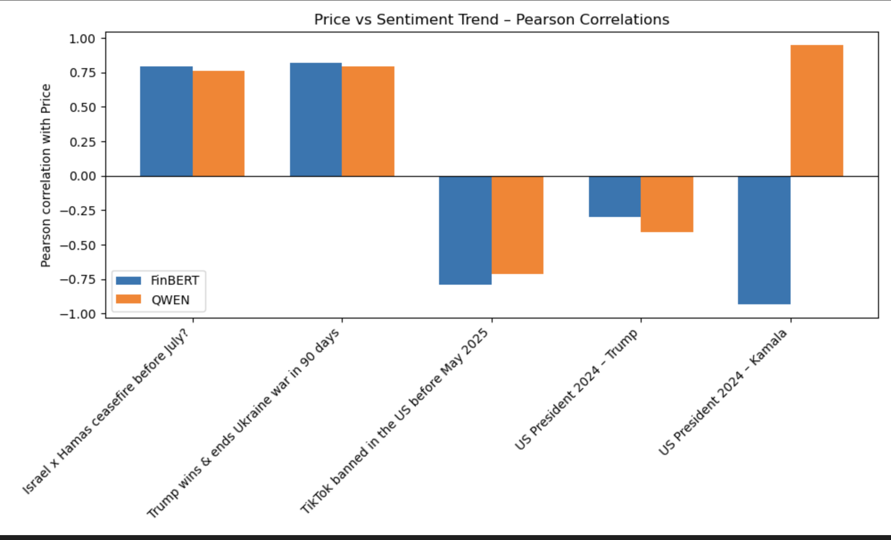
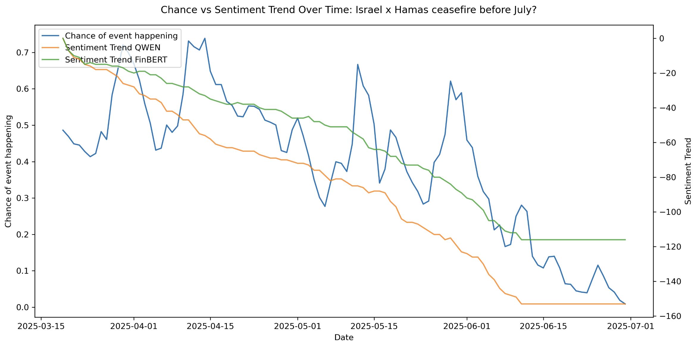
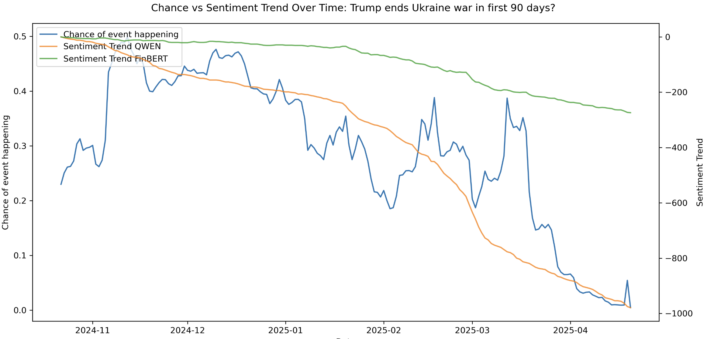

# ML News-Market Analysis

**Authors**: [LevMAn53](https://github.com/LevMAn53), [1wannabebetter1](https://github.com/1wannabebetter1)

Analysis of news sentiment correlation with prediction market prices using data from Polymarket and GDELT.

## Project Overview

This project examines the relationship between news media sentiment and prediction market movements. We collected price data from Polymarket for five major 2024-2025 events, gathered relevant news articles via GDELT, performed sentiment analysis using LLMs, and calculated correlations between sentiment trends and market prices.

## Data Collection

- **Prediction Markets**: Polymarket API (gamma-api.polymarket.com)
- **News Articles**: GDELT 2.0 Doc API
- **Events Analyzed**:
  - Presidential Election Winner 2024 - Kamala wins
  - Presidential Election Winner 2024 - Trump wins
  - Trump ends Ukraine war in first 90 days
  - Israel x Hamas ceasefire before July 2025
  - TikTok banned in the US before May 2025
g
## Methodology

1. **Event Selection**: Filtered 2024-2025 Polymarket events by volume (>$100k)
2. **Price Data**: Collected 60-second price data, aggregated to hourly averages
3. **News Filtering**: Used cross-encoder (ms-marco-MiniLM-L6-v2) to filter relevant articles by semantic similarity
4. **Sentiment Analysis**: Applied QWEN2.5 (7B, 14B) and FinBERT models to extract sentiment trends
5. **Correlation**: Calculated Pearson correlations between daily sentiment and market prices

## Results


### Sentiment vs Market Price Correlation
<div align="center" style="margin: auto;">

</div>

**Observed patterns**:
- Positive correlations (0.75-0.85) for Israel-Hamas and Ukraine events

- Negative correlations (-0.95 to -0.70) for US election markets
- Negative correlation (-0.70) for TikTok ban event
- QWEN and FinBERT models showed generally consistent patterns

### Time Series Analysis

<table>
<tr>
<td width="50%">

**Israel x Hamas Ceasefire**



Sentiment trends and market prices both declined over time, showing parallel movement patterns.

</td>
<td width="50%">

**Trump Ends Ukraine War**



Market prices declined alongside QWEN sentiment trends, while FinBERT maintained relatively stable negative sentiment values.

</td>
</tr>
</table>

## Project Structure

```
├── notebooks/               # Data collection, analysis, and sentiment processing
└── Results_archive/         # Computed results and visualizations
```

## Dependencies

- pandas, matplotlib, requests, tqdm
- transformers, torch, sentence-transformers
- QWEN2.5 (7B/14B quantized), FinBERT

## Notes

The negative correlations observed in US election markets indicate inverse relationships between sentiment and market prices. The reasons for these patterns remain unclear and may involve complex market dynamics, sentiment measurement limitations, or other factors not captured in this analysis.
